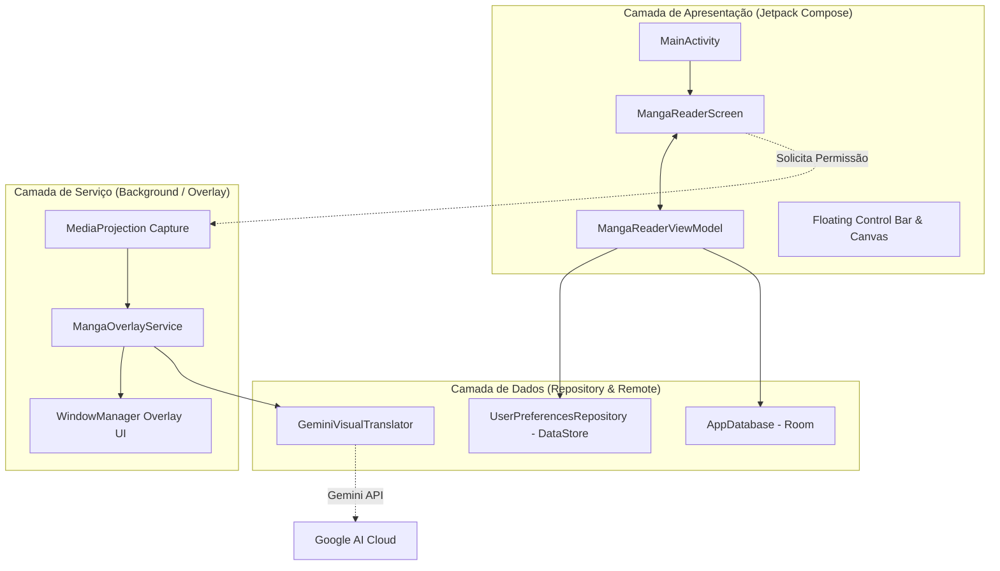

# MangaLens - Documentação de Arquitetura e Guia do Projeto

Este documento detalha a arquitetura técnica, fluxo de dados, estrutura de arquivos e instruções de compilação do **MangaLens**. Ele deve ser lido por **Agentes de IA** e desenvolvedores antes de efetuar qualquer modificação no código fonte.

---

## 1. 📌 Visão Geral do Projeto

**MangaLens** é um aplicativo Android desenvolvido em Kotlin que permite a tradução de páginas e quadros de mangás em tempo real por meio de uma sobreposição flutuante (overlay).

### Recursos Chave:
- **Captura de Tela em Tempo Real:** Utiliza a API `MediaProjection` do Android.
- **Processamento de IA (Gemini Visual Translator):** Utiliza o Google AI SDK (Gemini Multimodal) para reconhecer texto (OCR) e traduzir mantendo o contexto da leitura.
- **Interface Flutuante (Window Manager Overlay):** `Foreground Service` que desenha caixas de tradução sobre qualquer leitor de mangá ou navegador.
- **Leitor Integrado e Histórico:** Armazenamento local com Room Database e preferências com DataStore.

---

## 2. 🏗️ Arquitetura do Sistema

O projeto segue os princípios da **Clean Architecture** combinados com o padrão **MVVM (Model-View-ViewModel)** e **Android Foreground Services**.



---

## 3. 📂 Estrutura de Pacientes e Código Fonte

Todo o código principal do aplicativo está localizado no diretório: `app/src/main/java/com/example/`

```text
com.example/
├── MainActivity.kt               # Entrypoint, configuração do Jetpack Compose e solicitação de MediaProjection
├── service/
│   └── MangaOverlayService.kt    # Foreground Service que gerencia o WindowManager flutuante e captura de tela
├── data/
│   ├── model/
│   │   └── Models.kt             # Data classes (BoundingBox, TranslationResult, HistoryItem, AppSettings)
│   ├── local/
│   │   ├── AppDatabase.kt        # Banco de dados Room para histórico de traduções
│   │   └── UserPreferencesRepository.kt # DataStore para chaves de API, idioma alvo e configurações
│   ├── remote/
│   │   └── GeminiVisualTranslator.kt    # Cliente do Google AI SDK (Gemini) para OCR e tradução
│   └── samples/
│       └── SampleMangaData.kt    # Dados mockados para testes offline e preview no Compose
└── ui/
    ├── reader/
    │   ├── MangaReaderScreen.kt  # Tela principal do leitor integrando controles e visualizador
    │   └── MangaReaderViewModel.kt # ViewModel responsável pelo estado da UI e integração com repositórios
    ├── components/
    │   ├── FloatingControlBar.kt # Barra de controles flutuante sobreposta na tela
    │   ├── FloatingHistoryPanel.kt # Painel flutuante com histórico recente
    │   ├── MangaCanvasViewer.kt  # Canvas com zoom/pan e renderização das caixas de texto
    │   └── SettingsBottomSheet.kt# Modal bottom sheet para configuração de API key e idiomas
    └── theme/
        ├── Color.kt              # Paleta de cores do Material 3
        ├── Theme.kt              # Tema principal MangaLensTheme
        └── Type.kt               # Tipografia e fontes
```

---

## 4. 🛠️ Requisitos de Ambiente e Dependências

| Componente | Versão Requerida | Observações |
| :--- | :--- | :--- |
| **JDK** | Java 17+ (e.g. Temurin 17 / Microsoft OpenJDK 17) | Requer `jlink.exe` para o AGP 9.1+ |
| **Android SDK** | compileSdk 35, minSdk 24, targetSdk 35 | Verifique `local.properties` com o caminho do SDK |
| **Gradle** | 9.3.1+ | Executável `gradlew` / `gradlew.bat` no projeto |
| **AGP** | 9.1.1 | Android Gradle Plugin |

---

## 5. 🚀 Como Compilar e Gerar o APK Debug

### Passo 1: Configurar Variáveis de Ambiente
No terminal (PowerShell no Windows):
```powershell
$env:JAVA_HOME="C:\Users\eduardo.asousa\.jdk\jdk-17.0.12+7"
$env:ANDROID_HOME="C:\Users\eduardo.asousa\AppData\Local\Android\Sdk"
```

### Passo 2: Garantir o arquivo `local.properties`
Crie ou confirme se o arquivo `local.properties` existe na raiz do projeto:
```properties
sdk.dir=C:/Users/eduardo.asousa/AppData/Local/Android/Sdk
```

### Passo 3: Executar a Compilação do APK
Execute o comando Gradle para gerar o APK debug:
```powershell
.\gradlew.bat assembleDebug
```

### Passo 4: Localização do APK Gerado
Após a compilação ser concluída com sucesso, o arquivo APK gerado estará em:
```text
app/build/outputs/apk/debug/app-debug.apk
```

---

## 6. 📱 Como Testar no Celular (Passo a Passo)

1. **Transferir o APK:**
   - Conecte o celular via cabo USB e copie o arquivo `app-debug.apk` para a pasta *Downloads* do aparelho.
   - Ou envie o arquivo `app-debug.apk` para você mesmo via WhatsApp, Telegram ou Google Drive.
2. **Instalar no Celular:**
   - Abra o gerenciador de arquivos do celular, toque em `app-debug.apk` e selecione **Instalar**.
   - Se solicitado, autorize a opção **"Instalar de fontes desconhecidas"**.
3. **Conceder Permissões no Celular:**
   - **Sobrepor a outros apps (Overlay permission):** Ao abrir o app, autorize o MangaLens a ser exibido sobre outros aplicativos.
   - **Captura de Tela (MediaProjection):** Ao iniciar o serviço de tradução, confirme a mensagem do sistema autorizando a captura de tela.
4. **Configurar Chave da Gemini API:**
   - No app, abra as configurações e cole sua **Gemini API Key**.
   - Selecione o idioma de destino (ex: Português).
5. **Testar Tradução Flutuante:**
   - Abra qualquer aplicativo leitor de mangá ou site no navegador.
   - Toque no botão flutuante para capturar a tela e visualizar as sobreposições traduzidas em tempo real.

---

## ⚠️ Instruções Importantes para Agentes de IA

1. **Leia `AGENTS.md` e `architecture.md` antes de efetuar alterações.**
2. **Não commite arquivos de configuração local** (como `local.properties` ou caminhos absolutos) no repositório.
3. **Mantenha os padrões de Jetpack Compose:** Nomeie Composables em `CamelCase` e coloque `modifier: Modifier = Modifier` como primeiro parâmetro opcional.
4. **Sempre valide o build** executando `.\gradlew.bat assembleDebug` após alterações estruturais no código.
